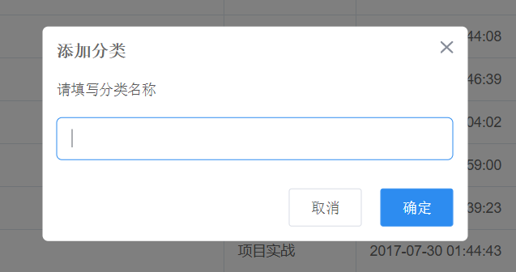

今天阅读了一些文章，完成实现了类似于elementUI下message组件`$message`调用方式的插件。可以通过类似的命令在vue实例中全局调用。<br>
具体效果如下


具体实现思路是

1. 创建`msgBox.vue`组件，设置参数及方法等。

2. 注册Vue全局插件！暴露install方法，在插件中在 `vue.prototype`上注册方法$showMsgBox，通过这个全局方法去调取

3. 再用`Vue.extend`全局命令，注册msgBox组件并通过`document.body.append`将节点添加到页面上展示。

## MsgBox组件

```
<template>
  <div class="message-box" v-show="isShowMessageBox">
      <div class="mask" @click="closeMsgBox"></div>
      <div class="message-content">
          <h3>{{title}}</h3>
          <p>{{content}}</p>
      </div>
  </div>
</template>

<script>
export default {
  data() {
    return {
        isShowMessageBox:true,
    }
  },
  props:{
      title:{
          type:String,
          default:'这里是标题',
      },
      content:{
          type:String,
          default: '这里是内容'
      }
  },
  methods: {
      closeMsgBox(){
          this.isShowMessageBox = false;
      },
  },
  components: {

  }
}
</script>

<style lang="scss">
    .message-box{
        position: relative;
        .mask{
            position: fixed; 
            top: 0;       //通过top,left,bottom,right的设置 使遮盖层覆盖全页面
            left: 0;
            bottom: 0;
            right: 0;
            z-index: 50000;
            background: rgba(0, 0, 0, 0.5);
        }
        .message-content{
            position: fixed;
            left: 50%;
            top: 50%;
            padding:20px 60px;
            z-index: 50001;
            background: #ffffff;
        }
    }
</style>
```

## Vue插件

#### 插件通常用来为 Vue 添加全局功能。插件的功能范围没有严格的限制——一般有下面几种：

1.添加全局方法或者属性。如: vue-custom-element

2.添加全局资源：指令/过滤器/过渡等。如 vue-touch

3.通过全局混入来添加一些组件选项。如 vue-router

4.添加 Vue 实例方法，通过把它们添加到 Vue.prototype 上实现。

5.一个库，提供自己的 API，同时提供上面提到的一个或多个功能。如 vue-router

#### 插件通过全局方法 Vue.use() 使用插件。它需要在你调用 new Vue() 启动应用之前完成：

```
// main.js
// 在主页面入口文件main.js中调用 MyPlugin.install(Vue)

import MessageBox from './components/MsgBox/index' //这里是引入插件的入口文件 
                                    //需要入口文件 export default来提供接口
Vue.use(MessageBox);

new Vue({
  // ...组件选项
})
```

#### Vue.js 的插件应该暴露一个 install 方法。这个方法的第一个参数是 Vue 构造器，第二个参数是一个可选的选项对象：
```
//index.js
import Vue from 'vue' //这里需要引入Vue
import msgboxVue from './MsgBox'

const MessageBox = {};

MessageBox.install = function(Vue,options){ //install方法传参 vue构造器和options
    const MessageBoxInstance = Vue.extend(msgboxVue); // 这一步通过Vue.extend创建一个“子类”。
    let currentMsg;
    const initInstance = () => {   //创建一个function生成vue组件并将其节点挂载到body上
      // 实例化vue实例
      currentMsg = new MessageBoxInstance();
      let msgBoxEl = currentMsg.$mount(); //通过vm.$mount()实例化，并不提供参数即挂载的节点，再通过获取虚拟节点用原生js挂载到body上。
      document.body.appendChild(msgBoxEl.$el); //挂载到body
    };

    Vue.prototype.$msgBox = { //注册Vue.prototype上全局方法
        showMsgBox(options){
            initInstance(); //调用方法在body上创建vue组件。
        }
    }
}

export default MessageBox; //通过export default 输出MessageBox对象，其暴露了install方法。


```

## Vue.extend

`Vue.extend` 属于 Vue 的全局 API，在实际业务开发中我们很少使用，因为相比常用的 `Vue.component` 写法使用 `extend` 步骤要更加繁琐一些。但是在一些独立组件开发场景中，`Vue.extend + $mount` 这对组合是我们需要去关注的。<br>

在 vue 项目中，我们有了初始化的根实例后，所有页面基本上都是通过 router 来管理，组件也是通过 import 来进行局部注册，所以组件的创建我们不需要去关注，相比 extend 要更省心一点点。但是这样做会有几个缺点：<br>

组件模板都是事先定义好的，如果我要从接口动态渲染组件怎么办？<br>
所有内容都是在 `#app` 下渲染，注册组件都是在当前位置渲染。如果我要实现一个类似于 `window.alert()` 提示组件要求像调用 JS 函数一样调用它，该怎么办？<br>
这时候，`Vue.extend + vm.$mount` 组合就派上用场了。<br>

我们照着官方文档来创建一个示例：

```
import Vue from 'vue'

const testComponent = Vue.extend({
  template: '<div>{{ text }}</div>',
  data: function () {
    return {
      text: 'extend test'
    }
  }
})
```
然后我们将它手动渲染：

`const extendComponent = new testComponent().$mount()`

我们可以通过 $el 属性来访问 extendComponent 组件实例，将其渲染到页面的body上：

`document.body.appendChild(extendComponent.$el)`

## vm.mount

`vm.$mount( [elementOrSelector] )`

返回值：`vm` - 示例本身

用法：如果 Vue 实例在实例化时没有收到 el 选项，则它处于“未挂载”状态，没有关联的 DOM 元素。可以使用 vm.$mount() 手动地挂载一个未挂载的实例。

如果没有提供 elementOrSelector 参数，模板将被渲染为文档之外的的元素，并且你必须使用原生 DOM API 把它插入文档中。（本文章主要用到的是这种方式）

这个方法返回实例自身，因而可以链式调用其它实例方法。

示例：

```
var MyComponent = Vue.extend({
  template: '<div>Hello!</div>'
})

// 创建并挂载到 #app (会替换 #app)
new MyComponent().$mount('#app')

// 同上
new MyComponent({ el: '#app' })

// 或者，在文档之外渲染并且随后挂载
var component = new MyComponent().$mount()
document.getElementById('app').appendChild(component.$el)
```

