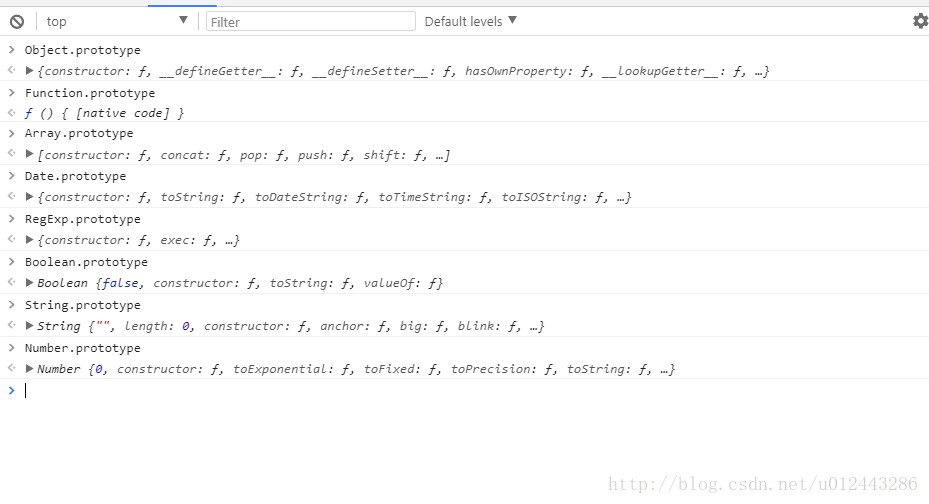
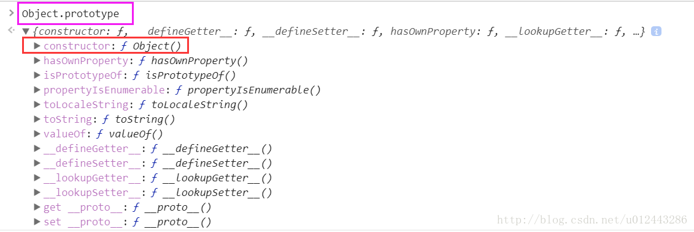
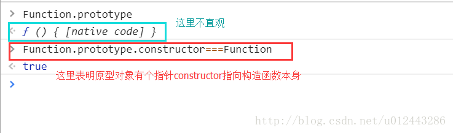
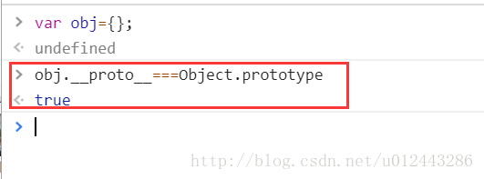

```
”每个构造函数都有一个原型对象，

原型对象都包含一个指向构造函数的指针，

实例都包含一个指向原型对象的内部指针。”

                        ——此段话摘自《JavaScript高级程序设计》。
```

#### 一、每个构造函数都有一个原型对象

比如： 

可以看到，每个构造函数本身都是一个对象，它会默认有一个属性叫做prototype（原型），它也是一个对象。

#### 二、原型对象都包含一个指向构造函数的指针

即prototype

prototype可理解为构造函数的一个公共仓库，方法和属性可以被同一个构造函数实例化出来的实例对象所使用。（重要！）

prototype（原型）会默认附带一个属性constructor（构造函数属性）指向构造函数。

prototype（原型）可理解成是构造函数的一个实例出来的对象。 它的constructor自然指向构造它出来的构造函数。





#### 三、实例都包含一个指向原型对象的内部指针 

即\_\_proto\_\_




#### 四、常见的构造函数及实例化如下

```
function Person(name, age, job) { //构造函数
    this.name = name;   //构造函数的一些属性（并没有在原型上）所以实例化时会重复占用内存
    this.age = age;
    this.job = job;
    this.sayName = function() { alert(this.name) } 
}
var person1 = new Person('Zaxlct', 28, 'Software Engineer');
var person2 = new Person('Mick', 23, 'Doctor');

console.log(person1.sayName == person2.sayName) //false 因为方法定义在函数内 未定义在原型prototype上，所以实例化时会重置生成。

//如果定义在prototype上

// Person.prototype.sayName = function() { alert(this.name) } ;
// console.log(person1.sayName == person2.sayName)  //true 因为方法定义在原型上可以同时被两个实例对象person1,person2所使用。

console.log(Person.prototype) // 这里类比如 构造函数Person的原型prototype就是一个构造函数Person的实例 
//像是 Person.prototype = {constructor:Person}; 该对象默认会有一个属性constructor 指向该实例的构造函数 Person。

console.log(Person.prototype === person1.__proto__)  // __proto__ 会指向原构造函数Person的原型prototype内部。
```